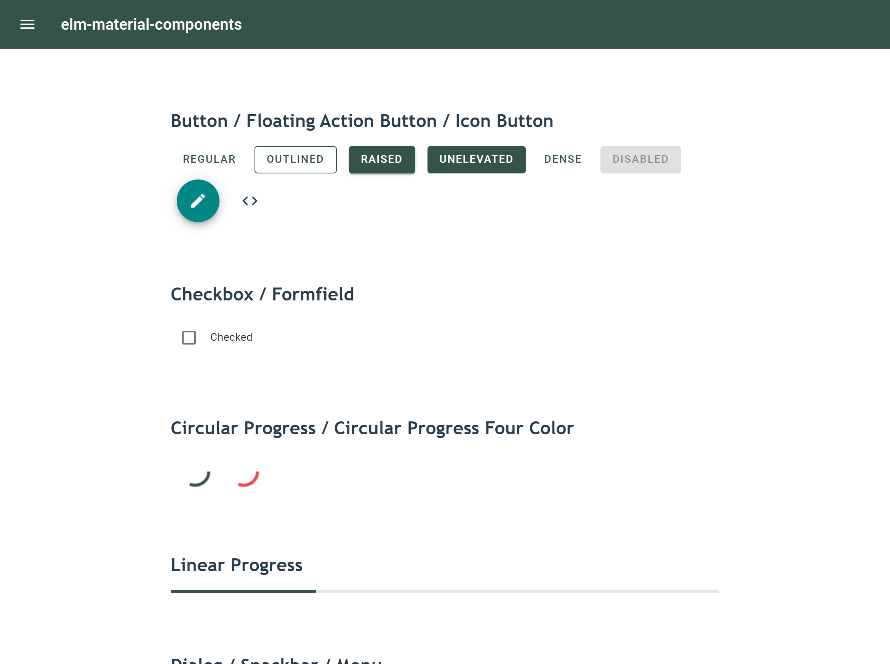

# elm-material-components



**elm-material-components** is yet another Material Components library for Elm. It is a simple wrapper for [material-components-web-components](https://github.com/material-components/material-components-web-components).

elm-material-components has classical `elm/html` style API. It has limited type safety but it is easy to understand. You can reuse `value` or `onClick` attribute from `Html.Attributes` for elements of elm-material-components. Use `Material.Attributes` package for missing attributes in `Html.Attributes`.

## Demo

- [https://elm-material-components.netlify.app/](https://elm-material-components.netlify.app/)

## Example

```elm
import Html exposing (div)
import Html.Attributes exposing (label, value)
import Html.Events exposing (onClick, onInput)
import Material exposing (button, switch, textfield)
import Material.Attributes exposing (raised)

view : Model -> Html Msg
view model =
    div []
        [ button [ raised, label "Hello", onClick Click] []
        , switch [] []
        , textfield [ value model.textFieldValue, onInput Input, label "textfield" ]
        ]
```

See [examples](examples/src/Main.elm) for more information.

## Installation

elm-material-components is not on Elm Packeges yet. To install it, execute `npm install aratama/elm-material-components` and add `node_modules/elm-material-components/src` into your `elm.json`. You may also need to install `elm/virtual-dom` and `elm/json`.

This package is just a thin wrapper and don't include any JavaScript codes. Therefore, for example, if you want to use `Material.button`, you need to do `npm install @material/mwc-button` to install original codes of material-components-web-components. Also you should add `import "@material/mwc-button";` into your `index.js`. See [material-components-web-components](https://github.com/material-components/material-components-web-components) docs for more information of installation.

See also [example/package.json](examples/package.json) and [`example/src/index.js`](examples/src/index.js).

## API Docs

You can see [the docs via elm-docs-preview site](https://elm-doc-preview.netlify.app/?repo=aratama/elm-material-components).

## See also

- [material-components-web-components](https://github.com/material-components/material-components-web-components)
- [aforemny/material-components-web-elm](https://github.com/aforemny/material-components-web-elm)
- [aforemny/elm-mdc](https://github.com/aforemny/elm-mdc)
- [achutkiran/material-components-elm](https://github.com/achutkiran/material-components-elm)
- [Lattyware/elm-material](https://github.com/Lattyware/elm-material)
